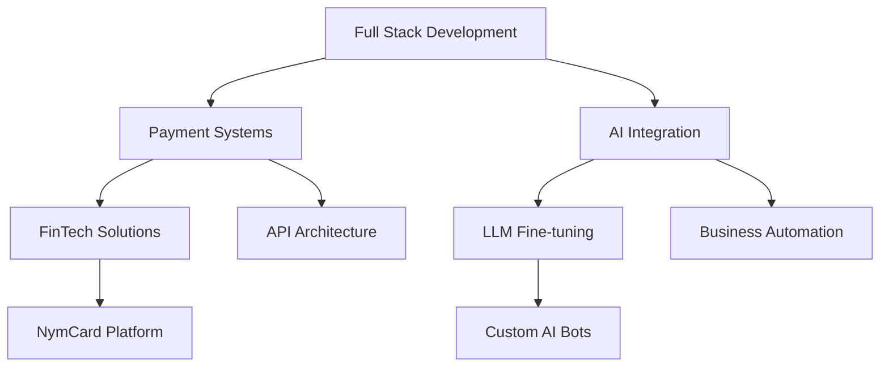

# Hello, I'm Mohit Kadwe 👨‍💻

  

  

---

## 🚀 **Professional Overview**

**Full Stack Engineer** at **NymCard** — architecting payment infrastructure that powers fintech innovation across the MENA region.

**AI Solutions Developer** — Creating custom AI automation systems by fine-tuning **Azure OpenAI**, **Gemini**, and **Claude** models to solve complex business challenges.

**Mentor & Technical Leader** — Passionate about scaling development teams and empowering the next generation of software engineers.

---

## 💼 **Core Expertise**

### **🎯 Languages & Frameworks**

### **🤖 AI/ML & Cloud**

### **🗄️ Backend & Database**

---

## 🏆 **Key Achievements**

| 🎯 **Achievement** | 📊 **Impact** | 🏅 **Recognition** |
|:--:|:--:|:--:|
| **National Hackathon Winner** | Led "TheMetadaters" to 1st place | Physics Wallah Rajasthan IT Day |
| **Microsoft Imagine Cup Finalist** | All India 2nd Rank | 2021 National Competition |
| **Smart India Hackathon** | 2nd Rank Nationally | 2022 Government Initiative |
| **LeetCode Consistency** | 300+ Problems Solved | 170+ Day Streak |
| **Mentorship Impact** | 100+ Developers Trained | The 10x Academy |
| **AI Solutions Delivered** | Custom Business Automation | Multiple Client Projects |

---

## 📊 **GitHub Performance**

  
  

  

  

---

## 🎯 **Professional Focus Areas**

### **💳 FinTech Development**
- **Payment Infrastructure** at NymCard - MENA's leading embedded finance platform
- **API Architecture** - Building scalable systems with 1000+ integrations
- **Compliance & Security** - Implementing robust financial solutions

### **🤖 AI Solutions Architecture**
- **Model Fine-tuning** - Azure OpenAI, Gemini, Claude for business-specific use cases
- **Custom AI Bots** - Automated solutions for personal and enterprise workflows
- **Integration Expertise** - Seamlessly embedding AI into existing business processes

### **👥 Technical Leadership**
- **Team Mentoring** - Guided 100+ developers in full-stack development
- **Knowledge Sharing** - Regular contributor to developer education and best practices
- **Innovation Driver** - Leading adoption of cutting-edge technologies in teams

---

## 🌟 **What Sets Me Apart**

> **"Bridging the gap between traditional software engineering and AI-powered innovation"**

- ✅ **Proven Track Record** - National-level competition winner with measurable results
- ✅ **Industry Impact** - Building payment systems that serve millions of users
- ✅ **AI Expertise** - Hands-on experience with latest LLM technologies and fine-tuning
- ✅ **Global Experience** - Worked across India, Australia, and Middle East markets
- ✅ **Continuous Learning** - Consistent problem-solving practice and skill enhancement
- ✅ **Leadership Ready** - Experienced in mentoring teams and driving technical decisions

---

## 📞 **Let's Connect**

### **Open for Opportunities** 🚀

**Interested in:** Senior Engineering Roles | AI/ML Projects | Technical Leadership | Consulting

---

**💡 "Building tomorrow's solutions with today's cutting-edge technology"**

<!-- GitHub Activity -->

