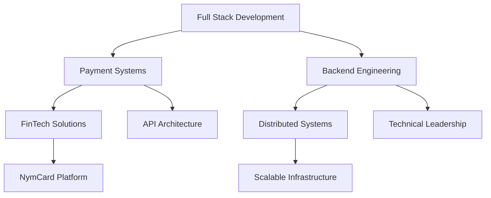

# Hi, I'm Mohit Kadwe 

  

---

## 🚀 About Me

**Full Stack Engineer** at **NymCard** — architecting payment infrastructure across the MENA region.

**Mentor & Technical Leader** — Trained 100+ developers at The 10x Academy. Passionate about building teams that ship.

5+ years across fintech, backend systems, and platform engineering. Currently focused on scalable API design, payment processing, and developer tooling.

---

## 💼 Core Expertise

### Languages & Frameworks

### Backend & Infrastructure

---

## 🏆 Achievements

| Achievement | Result |
|:--|:--|
| Physics Wallah Rajasthan IT Day Hackathon | 🥇 1st Place — led team "TheMetadaters" |
| Microsoft Imagine Cup 2021 | 🥈 All India 2nd |
| Smart India Hackathon 2022 | 🥈 National 2nd |
| LeetCode | 300+ problems solved |
| The 10x Academy | 100+ developers mentored |

---

## 🎯 Professional Focus Areas

```mermaid
graph TD
    A[Full Stack Development] --> B[Payment Systems]
    A --> C[Backend Engineering]
    B --> D[FinTech Solutions]
    B --> E[API Architecture]
    C --> F[Distributed Systems]
    C --> G[Technical Leadership]
    D --> H[NymCard Platform]
    F --> I[Scalable Infrastructure]
```

### 💳 FinTech Development
- **Payment Infrastructure** at NymCard — MENA's leading embedded finance platform
- **API Architecture** — Building scalable systems handling 1000+ integrations
- **Compliance & Security** — Implementing robust, production-grade financial solutions

### 🏗️ Backend Engineering
- **Distributed Systems** — Designing services that scale across high-transaction environments
- **API Design** — RESTful and GraphQL APIs built for reliability and developer experience
- **Database Architecture** — Schema design and query optimization across SQL and NoSQL

### 👥 Technical Leadership
- **Team Mentoring** — Guided 100+ developers in full-stack development at The 10x Academy
- **Knowledge Sharing** — Regular contributor to developer education and engineering best practices
- **Innovation Driver** — Leading adoption of modern technologies within engineering teams

---

## 📊 GitHub Stats

  
  

  

  

---

## 📞 Let's Connect

**Open to:** Senior Engineering Roles · Technical Leadership · Consulting

