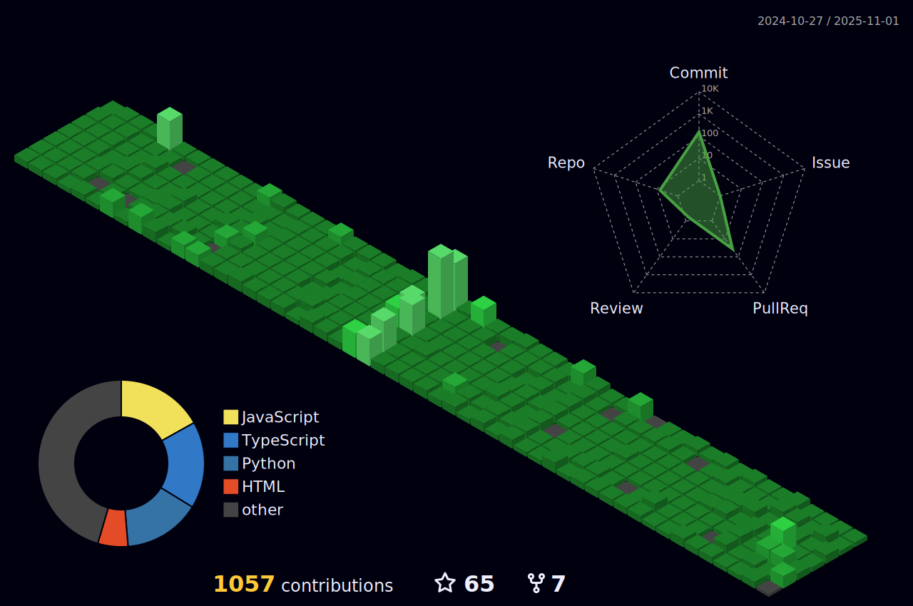

# ✨Hi  My name is Mohit

# 💫 About Me:
🔭 I’m currently working on improving my development skills 🌱 I’m currently learning system Design 🤔 I’m looking for help with contributing to open source projects 💬 Ask me about tech related stuffs ⚡ Fun fact: I procrastinate more than I code

## 🌐 Socials:
   

# 📊 GitHub Stats:

